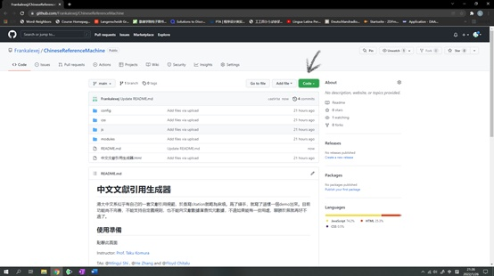
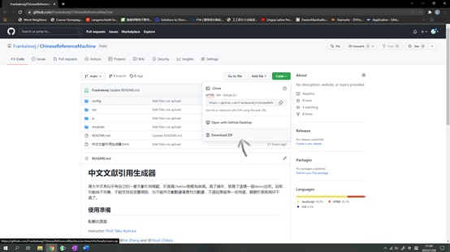
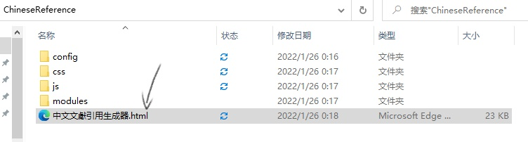
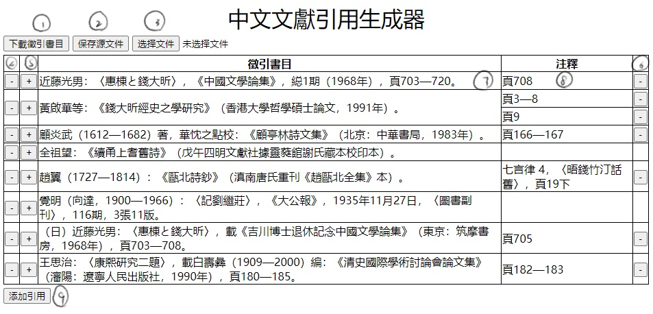

# 中文文獻引用生成器
港大中文似乎有自己的一套文獻引用規範，於是寫citation就略為麻煩。爲了練手，就寫了這樣一個demo出來。目前功能尚不完善，不能支持自定義規則，也不能向文獻數據庫查找元數據，不過如果能有一些用處，聊勝於無就再好不過了。

如果您希望使用該生成器，請跟從以下步驟下載文件。

如果您在使用過程中有任何意見和建議，敬請聯絡本人或在本頁面Issue欄下提交問題，多謝您的支持！

## 使用準備
點擊此頁面右上角綠色Code按鈕，再點擊Download ZIP即可下載。

下載后解壓到任意路徑，打開“中文文獻引用生成器.html”文件即可使用。

生成器目前完全依賴瀏覽器運行，在windows和mac主流瀏覽器上應該都可以使用。

## 簡單的説明書
1. 生成器目前完全基於香港大學中文學院印發的《研究論文格式舉要》。實現了其中論文、高級學位論文、今版書籍、古版書籍的徵引及注釋部分。自定義規則這部分做了一些，還不可用，目前還是基本上按照規則定制，有空研究研究怎麽搞，（當然有有此愛好的同仁也歡迎加入😀）。
2. 主頁面顯示目前已經輸入的徵引書目及其注釋，有九処可以點擊的位置，分別如下：

  - `1` 下載徵引書目：導出已有的徵引書目及其注釋，徵引書目按作者漢字筆畫排序，注釋按徵引書目及注釋輸入順序排序。
  - `2` 保存源文件：保存已輸入的内容，該生成器默認使用瀏覽器提供的本地儲存，但為保數據安全及跨設備使用，可考慮下載源文件。
  - `3` 選擇文件：選擇源文件上載。注意，上載源文件會覆蓋現存於本地儲存中的數據。
  - `4` 刪除徵引書目(Reference)：會同時刪除其下的所有注釋。
  - `5` 增加注釋(Footnote)：在該書目下新增注釋，其書目數據完全跟從所屬的書目。
  - `6` 刪除注釋(Footnote)：刪除該注釋。
  - `7` 修改徵引書目。
  - `8` 修改注釋。
  - `9` 新增徵引書目。

Instructor: [Prof. Taku Komura](https://www.cs.hku.hk/index.php/people/academic-staff/taku)

TAs: @[Mingyi Shi](https://rubbly.cn) , @[He Zhang](https://cghezhang.github.io) and @[Floyd Chitalu](https://github.com/chitalu)

## Assignment 1 - Basic Character Animation

In this assignment, you will learn the basic data structure and animation creation pipeline and are required to create an animation clip with provided Infrastructure. Also, you need to understand the mathematics in FK and IK for reading the motion capture files and playing with them.

All software-related codes will be provided by @[Mingyi Shi](https://rubbly.cn) and @[He Zhang](https://cghezhang.github.io), only the core codes need to be filled in.

More details: [subfolder](./assignment_1)

#### Assessments (due to 13th. Feb)

* A rendered video with character animation (Quiz1, 15%)
* BVH file visualizer in Blender/Unity (45%)
* An IK solver in Unity (30%)
* Report (10%)

## Assignment 2 - Data Driven Character Animation

In this assignment, you will learn the basic knowledge of sequential prediction with a deep neural network and learn the specifications which are useful in character animation.
The TAs will provide a runnable character animation framework that includes all the data processing, training/testing, and visualization functions, but the network works not well on human motion data. You are required to modify the data flow or network structure to make it available. (due to 13th. March )

## Assignment 3 - TBA

## Assignment 4 - TBA

pls contact myshi@cs.hku.hk if there is any question.
