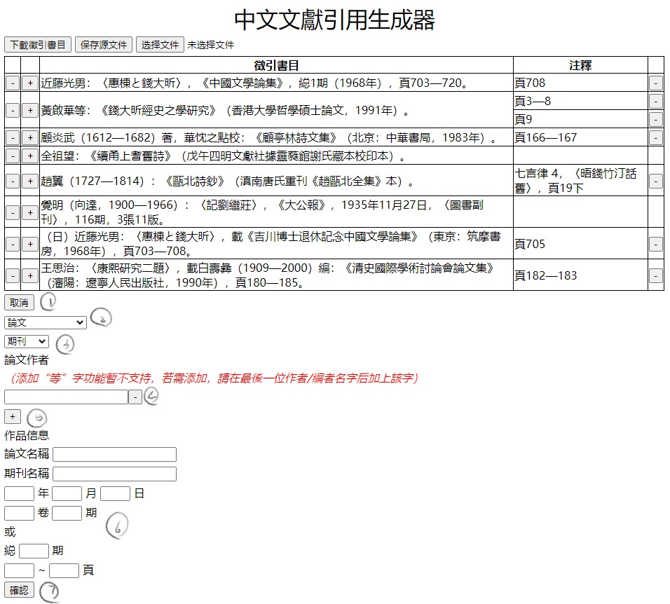

# 中文文獻引用生成器
港大中文似乎有自己的一套文獻引用規範，於是寫citation就略為麻煩。爲了練手，就寫了這樣一個demo出來。目前功能尚不完善，不能支持自定義規則，也不能向文獻數據庫查找元數據，不過如果能有一些用處，聊勝於無就再好不過了。

如果您希望使用該生成器，請跟從以下步驟下載文件。

如果您在使用過程中有任何意見和建議，敬請聯絡本人或在本頁面Issue欄下提交問題，多謝您的支持！

## TODO
1. 解決西文引號衝突bug. 加入自動符號調整（中文化、引號前後調整、空格刪減等）。
2. 將注釋之輸出調整爲按全局輸入順序，以便複製脚注。
3. 加入bibtex轉入中文引用格式機制。

## 使用準備
點擊此頁面右上角綠色Code按鈕，再點擊Download ZIP即可下載。

下載后解壓到任意路徑，打開“中文文獻引用生成器.html”文件即可使用。

生成器目前完全依賴瀏覽器運行，在windows和mac主流瀏覽器上應該都可以使用。

## 簡單的説明書
1. 生成器目前完全基於香港大學中文學院印發的《研究論文格式舉要》。實現了其中論文、高級學位論文、今版書籍、古版書籍的徵引及注釋部分。自定義規則這部分做了一些，還不可用，目前還是基本上按照規則定制，有空研究研究怎麽搞，（當然有有此愛好的同仁也歡迎加入😀）。
2. 主頁面顯示目前已經輸入的徵引書目及其注釋，有九処可以點擊的位置，分別如下：

  - `1` 下載徵引書目：導出已有的徵引書目及其注釋，徵引書目按作者漢字筆畫排序，注釋按徵引書目及注釋輸入順序排序。
  - `2` 保存源文件：保存已輸入的内容，該生成器默認使用瀏覽器提供的本地儲存，但為保數據安全及跨設備使用，可考慮下載源文件。
  - `3` 選擇文件：選擇源文件上載。注意，上載源文件會覆蓋現存於本地儲存中的數據。
  - `4` 刪除徵引書目(Reference)：會同時刪除其下的所有注釋。
  - `5` 增加注釋(Footnote)：在該書目下新增注釋，其書目數據完全跟從所屬的書目。
  - `6` 刪除注釋(Footnote)：刪除該注釋。
  - `7` 修改徵引書目。
  - `8` 修改注釋。
  - `9` 新增徵引書目。
3. 點擊新增引用后出現表格，功能分別如下：
  - `1` 取消新增引用。
  - `2` 選擇文獻類型：目前包含論文、高級學位論文、今版書籍、古版書籍。
  - `3` 選擇子類型：目前僅有論文類包含期刊、報章、論文集。
  - `4` 刪除作者：目前作者、論文集著者、編者有此功能。
  - `5` 增加作者。
  - `6` 各類信息填寫，若無則不填。
  - `7` 確認：提交。

